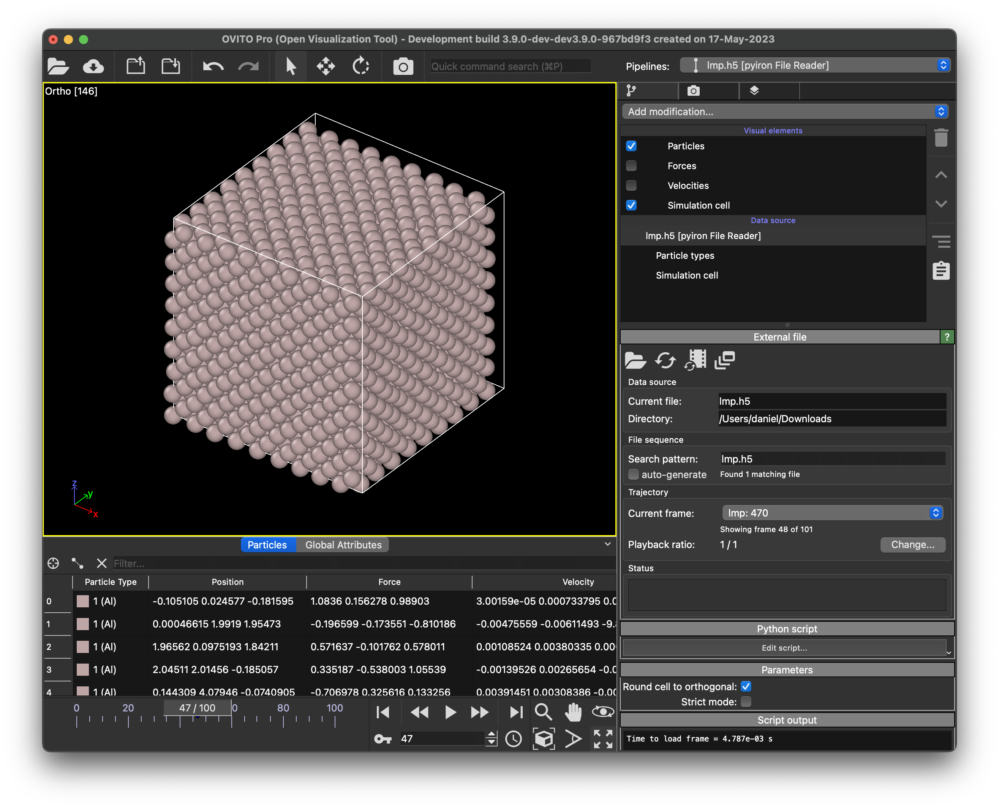

# pyiron File Reader
*OVITO* Python file reader for the h5 data containers written by *pyiron*.

## Description
Python file reader for *OVITO* that reads structural data from the hdf5 containers written by [*pyiron*](https://pyiron.org/). After installation, *OVITO* will auto-detect *pyiron* files and open them for analysis and visualization. 
Note, that the *"status"* of the pyiron job needs to be *"finished"* before its file can be read.
The following table gives an overview over all *particle properties* and *attributes* currently understood by this parser. Optional properties will be skipped if they are not included in the file **and** the parser is not in strict mode.

**Particle properties**
| pyiron name | OVITO name | Components | Optional |
| --- | --- | :---: | :---: |
| `generic/indices` | `Particle Type` | `1` | |
| `generic/unwrapped_positions` | `Position` | `3` | `x*` |
| `generic/positions` | `Position` | `3` | `x*`|
| `generic/forces` | `Force` | `3` | `x` |
| `generic/velocities` | `Velocity` | `3` | `x` |

`*` One of `generic/unwrapped_positions` or `generic/positions` is required.

**Attributes**
| pyiron name | OVITO name | Components | Optional |
| --- | --- | :---: | :---: |
| `generic/steps` | `Timestep` | 1 | |
| `generic/natoms` | `Number of atoms` | 1 | |
| `generic/temperature` | `Temperature` | 1 | `x` |
| `generic/energy_tot` | `Total energy` | 1 | `x` |

The file reader can be installed either into *OVITO Pro* or the [*OVITO* Python module](https://pypi.org/project/ovito/) Python module using *pip*.

## Parameters
- `roundCell` / "Round cell to orthogonal": Round the off-diagonal components of the simulation cell to `0` if they are below a threshold value currently hard-coded to `1e-8` A.
- `strict` / "Strict mode": Activate strict mode which requires all optional keys to be present in the pyiron data container. In strict mode, any missing key will raise a `KeyError`. The default (non-strict) mode silently skips all missing optional keys.

## Example
1. [Example 01](Examples/example_01.py) loads the [`lmp.h5` structure file](Examples/lmp.h5) and prints all *particle properties* and *attributes* found therein.

The following image shows the same file in the *OVITO PRO* desktop application.


### Example data generation
The example data was generated using the [`generate_example_data_01.py`](Examples/generate_example_data_01.py) script using `pyiron`. For more information visit their [website](https://pyiron.org/).

## Installation
- OVITO PRO built-in Python interpreter
```
ovitos -m pip install --user https://github.com/nnn911/pyironFileReader/main/archive.zip
``` 
- Standalone Python package or Conda environment
```
pip install --user https://github.com/nnn911/pyironFileReader/main/archive.zip
```
- Please note that the `--user` tag is recommended but optional and depends on your Python installation.

## Technical information / dependencies
- Tested with *OVITO* 3.9.0
- Depends on:
    - `numpy` 
    - `h5py`

## Adding new properties or attributes
New optional *particle properties* and *attributes* can be included in the parser quite easily. To add new particle properties, include them in the `particle_props_dict` of the `PyironFileReader` class, which can be found [here](src/pyironFileReader/__init__.py). Similarly, new attributes need to be added to the `attributes_dict`. Both dictionaries map `pyiron names` to `OVITO names`. If you add new properties consider contacting the author or submitting a pull request to make these changes available to the whole community.

## Contact
- Daniel Utt (utt@ovito.org)